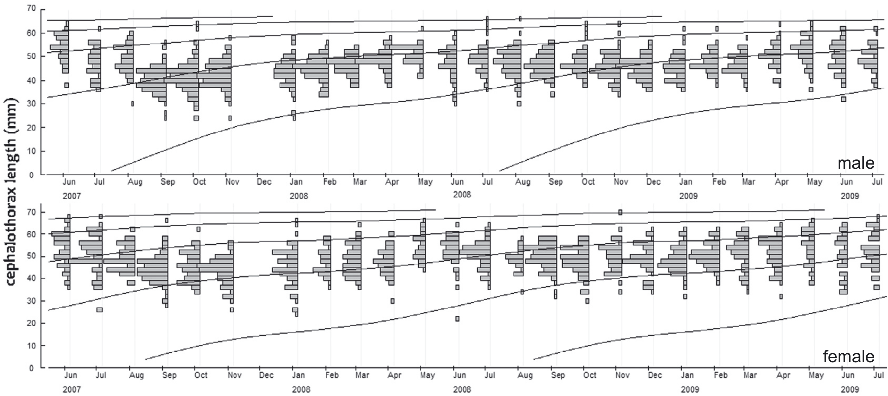

```{r, include = FALSE}
knitr::opts_chunk$set(
  collapse = TRUE,
  comment = "#>"
)
```

## What is **ELEFAN**?

The ELEFAN (Electronic Length Frequency Analysis) method is a widely used technique in fishery science for assessing fish populations. It analyzes the size distribution (length-frequency data) of fish samples to estimate key population parameters, such as growth rates, mortality, and recruitment patterns. By fitting growth curves to the size data, ELEFAN helps researchers understand the dynamics of fish stocks, which is crucial for sustainable fishery management. It is particularly useful for species where age data is difficult to obtain, making it a valuable tool in tropical and subtropical fisheries.

{width="100%"}

## What are `ELEFAN_SA` and `ELEFAN_GA`, and what they do?

## What are `ELEFAN_SA_boot` and `ELEFAN_GA_boot`, and what benefits do they offer?

```{r setup}
library(fishboot)
```
